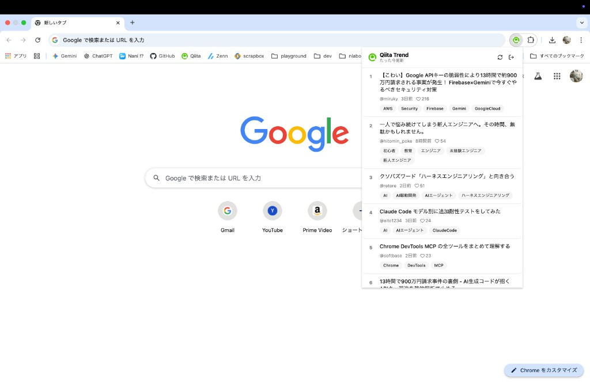

# qiita-trend-viewer

Qiitaのトレンド記事をブラウザのツールバーから確認できるChrome拡張。



## インストール

1. [Releases ページ](https://github.com/kamata-bug-factory/qiita-trend-viewer/releases/latest) から最新の `qiita-trend-viewer-vX.X.X.zip` をダウンロード
2. zip を解凍
3. Chrome で `chrome://extensions` を開く
4. 右上の「デベロッパーモード」を有効化
5. 「パッケージ化されていない拡張機能を読み込む」をクリックし、解凍したフォルダを選択

## 使い方

1. ツールバーの Qiita Trend Viewer アイコンをクリック
2. 初回は Qiita の個人用アクセストークン（`read_qiita` スコープ）を設定
3. トレンド記事の一覧が表示されます

トークンの発行は [Qiita の設定ページ](https://qiita.com/settings/tokens/new) から行えます。

## 開発

```bash
npm install     # 依存インストール
npm run dev     # 開発サーバー起動
npm run build   # プロダクションビルド
npm run lint    # ESLint 実行
npm run typecheck  # 型チェック
```

### ローカルで拡張機能をテスト

1. `npm run build` でビルド
2. Chrome で `chrome://extensions` を開く
3. 「デベロッパーモード」を有効化
4. 「パッケージ化されていない拡張機能を読み込む」から `dist/` を選択

## リリース

タグを push すると GitHub Actions が自動でビルドし、Release に zip を添付します。

```bash
git tag v1.0.0
git push origin v1.0.0
```

## ライセンス

[MIT](./LICENSE)
