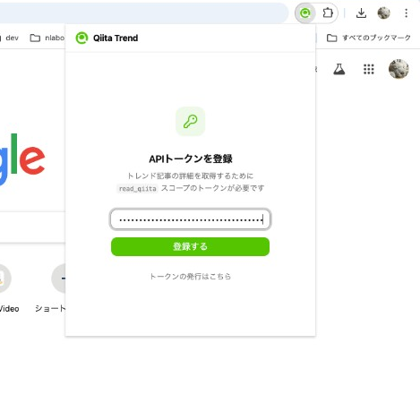
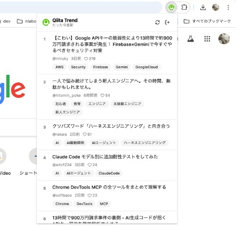

## はじめに

Qiitaのトレンド記事、毎日チェックしていますか？

私は日課にしているのですが、毎回ブラウザでQiitaのトップページを開いて確認するのが地味に面倒でした。
「ツールバーからワンクリックで見れたら楽なのに」と思い、Chrome拡張機能 **Qiita Trend Viewer** を作りました。

https://github.com/kamata-bug-factory/qiita-trend-viewer

## 何ができるか

ツールバーのアイコンをクリックするとポップアップが開き、Qiitaのトレンド記事 Top10 が一覧表示されます。

各記事には以下の情報が表示されます。

- 記事タイトル（クリックで記事ページに遷移）
- 著者名
- タグ一覧
- LGTM数

| 初回はトークンを登録 | トレンド記事が一覧表示される |
| :---: | :---: |
|  |  |

記事データは `chrome.storage.local` に3時間キャッシュされるため、ポップアップを開くたびにAPIリクエストが走ることはありません。

## 技術スタック

| 項目 | 技術 |
| --- | --- |
| 言語 | TypeScript（strict mode） |
| UI | React 19 + Vite |
| UIライブラリ | shadcn/ui + Tailwind CSS v4 |
| Chrome拡張 | Manifest V3 |
| ビルド | Vite + CRXJS Vite Plugin |
| CI/CD | GitHub Actions（タグ push で自動リリース） |

Chrome拡張のビルドには [CRXJS Vite Plugin](https://crxjs.dev/vite-plugin/) を使っています。
`manifest.json` を Vite の設定にそのまま渡すだけで、HMR 付きの開発環境とプロダクションビルドの両方が手に入ります。

```typescript
// vite.config.ts
import { crx } from "@crxjs/vite-plugin";
import manifest from "./public/manifest.json";

export default defineConfig({
  plugins: [react(), tailwindcss(), crx({ manifest })],
});
```

## アーキテクチャ

### ディレクトリ構成

```
src/
├── popup/           # ポップアップUI（エントリポイント）
│   ├── App.tsx
│   └── components/  # ArticleCard, TokenForm など
├── components/      # 共有UIコンポーネント（shadcn/ui）
├── hooks/           # useToken, useArticles
├── services/        # 外部通信
│   ├── feed.ts      # Qiitaフィードのパース
│   └── api.ts       # Qiita API クライアント
├── storage/         # chrome.storage ラッパー
│   ├── token.ts     # トークン管理
│   └── cache.ts     # 記事キャッシュ管理
└── types/           # 型定義
```

### データ取得の流れ

トレンド記事のデータは2段階で取得します。

```
1. フィード取得   : GET https://qiita.com/popular-items/feed
                    → 記事ID, タイトル, 著者名を取得（上位10件）

2. API で詳細取得 : GET /api/v2/items/:item_id × 10件
                    → タグ一覧, LGTM数を補完
```

Qiitaのトレンド記事一覧を返す公式APIは存在しないため、Atom フィードをパースして記事一覧を取得し、個別記事のAPIでタグやLGTM数を補完する方式にしました。

## 実装のポイント

### フィードのパース

Qiitaのトレンド記事一覧を返す公式APIは存在しません。
HTMLをスクレイピングする方法もありますが、Qiitaの利用規約ではスクレイピングが禁止されています。

そこで、Qiitaが公開している Atom フィード（`https://qiita.com/popular-items/feed`）を `DOMParser` でパースして記事一覧を取得する方式にしました。
フィードからは記事ID・タイトル・著者名が取れるので、タグやLGTM数は個別記事のAPIで補完します。

### N+1 リクエストの抑制

フィードからは最大30件の記事が取得できますが、タグとLGTM数の取得には記事ごとに `GET /api/v2/items/:item_id` を叩く必要があります。
30件すべてにリクエストを投げるとレート制限に引っかかるリスクがあるため、表示対象を上位10件に限定しました。

さらに、10件の詳細取得は `Promise.all` で並列実行して体感速度を短縮し、取得結果を `chrome.storage.local` に3時間キャッシュすることで、ポップアップを開くたびにリクエストが走るのを防いでいます。

## リリース自動化

タグを push すると GitHub Actions が自動でビルドし、GitHub Release に zip を添付します。

```yaml
name: Release Chrome Extension

on:
  push:
    tags:
      - "v*"

jobs:
  release:
    runs-on: ubuntu-latest
    steps:
      - uses: actions/checkout@v4
      - uses: actions/setup-node@v4
        with:
          node-version: 20
          cache: npm
      - run: npm ci
      - run: npm run build
      - name: Create zip
        run: cd dist && zip -r ../qiita-trend-viewer-${{ github.ref_name }}.zip .
      - name: Create GitHub Release
        uses: softprops/action-gh-release@v2
        with:
          files: qiita-trend-viewer-${{ github.ref_name }}.zip
          generate_release_notes: true
```

ユーザーは Release ページから zip をダウンロードし、Chrome の「パッケージ化されていない拡張機能を読み込む」で利用できます。

## おわりに

インストール方法や使い方はリポジトリの README を参照してください。

https://github.com/kamata-bug-factory/qiita-trend-viewer

Qiita Trend Viewer でトレンドの波に乗れ！！！
